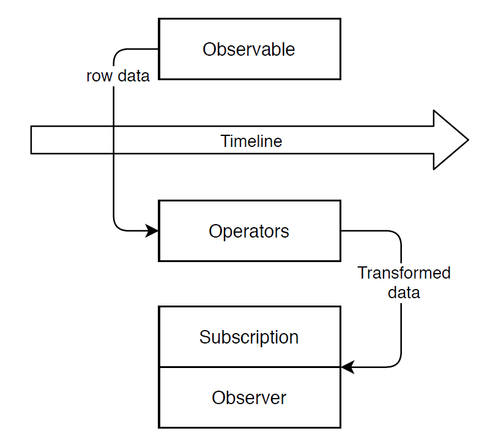

# Observable

## Table of Contents  
* [Introduction](#Introduction)<br>
* [Custom Observable](#Custom-Observable)<br>
* [Custom Data Emitting Observable](#Custom-Data-Emitting-Observable)<br>
* [Error or Completion Observable](#Error-or-Completion-Observable)<br>
* [Operators](#Operators)<br>
* [Implement Operators using Pipe](#Implement-Operators-using-Pipe)<br>
* [Subjects](#Subjects)<br>

## Introduction

1. Observable emits different kind of data

2. This data can be absorbed by observer (a code implemented by us)

3. There are various kind of Observables, and can produce 3 kind of data

4. Data produced by observable

   1. Normal data (string, number, object etc)
   2. Error (error which can occur while observing the data)
   3. Process completion (flag)

5. Observer = Code implemented by us

6. Observer should handle the data as follow

   1. Data handling 
   2. Error handling
   3. Completion handling

7. Param in routing section was one of the built in observable 

8. So to obtain data from Param observable when it emits the data we need to subscribe to it in our code

9. Param emits the data whenever user reaches to that link [event occures]

10. Lets subscribe to this Param observable of router

    ~~~typescript
    id;
    constructor(private route:Route){}
    
    sampleMethod(){
        this.route.Params.subscribe(
    		(params:Params) => {
            	this.id = +params.id;
        	});
    }
    ~~~

## Custom Observable

1. Along with Default observable, we can make our own custom observable in angular

2. Observable are not default part of typescript but implemented by rxjs library

3. Note: Always unsubscribe the custom observable, when component where subscription of the custom observable happen get destroyed

   ~~~typescript
   import { interval , subscription } from 'rxjs';
   
   export class HomeComponent implements OnInit, OnDestroy {
       private sub : Subscription;
       
       ngOnInit(){
           this.sub = interval(1000).subscribe(
           count => {
               console.log(count);
           	})
       }
       
       ngOnDestroy(){
           this.sub.unsubscribe();
       }
   }
   ~~~

## Custom Data Emitting Observable

1. Create an observable and emit the data [OBSERVABLE]

   ~~~typescript
   // observable
   const customIntervalObsrv = Observable.create(
   	observer => {
           let count = 0;
           setInterval(() => {
               observer.next(count);		// next is used to emit the data from observable
               count++;
           },1000)
       }
   )
   
   // above implemented observable will emit the data at defined interval
   ~~~

2. Subscribe to the above implemented observable [OBSERVER]

   ~~~typescript
   //Observer
   private sub : Subscription;
   
   this.sub = customIntervalObsrv.subscribe(
   	data => {
           console.log(data);
       }
   );
   
   // subscribe to the observable and listen the emitted data
   ~~~

## Error or Completion Observable

1. Throwing an error as well as completion from observable

   ~~~typescript
   // In Observable which was implemented in previous section
   if(count > 3){
      Observer.error(new Error('count is greater then 3'));
      }
   
   if(count === 2){
      Observer.complete();
      }
   ~~~

2. Handling an error at Observer

   ```typescript
   customIntervalObsrv.subscribe(
   	data => {
           console.log(data);
       },
       error => {
           console.log(error);
           alert(error.message);
       },
       () => {
           console.log('completed');
       }
   );
   ```

3. If the Observable emits the completion, then you do not need to unsubscribe the observable at Observer

## Operators

1. The data obtained from Observable is raw data

2. This data can be transformed according to the need before it received by Observer

3. This transformation done after Observable emits the data and before Observer work on the emitted data

   

## Implement Operators using Pipe

1. Every observable provided by rxjs library has method called ```pipe()```

2. This method can be used as follow

   ~~~typescript
   const customIntervalObservable.pipe();
   // the operator code goes inside pipe method
   ~~~

3. Example: Observable 

   ~~~typescript
   const customIntervalObservable = Observable.Create(
   	observer => {
   		// event emitting code will go here
   	}
   )
   ~~~

4. Example: Observer

   ~~~typescript
   sub : Subscription = customIntervalObservable.subscribe(
   	data => {/*Observable event data will be received here*/},
       error => {/*Observable event error will be received here*/},
       () => {/*Observable event completion will be received here*/}
   )
   ~~~

5. Example: Operator

   ~~~typescript
   let transformOperator = customIntervalObservable.pipe(map(
   		(data:number) => {
           	let returnString = 'round:' + (data1);
               return returnString;
       	}
   ));
   
   //after implemanting the operator, now Observer will subscribe the operator instead of Observable
   ~~~

6. Modified Observer : subscribed to the Operator instead of Observable

   ~~~typescript
   sub : Subscription;
   
   this.sub = transformOperator.subscribe(
   	data => {
           console.log(data); // this data is received from operator and not from Observable
       }
   );
   ~~~

## Subjects

1. Subjects are specifically used when services are implemented for the purpose of component to component communication

2. Sample service Example : ```user.service.ts```

   ~~~typescript
   import { Injectable } from '@angular/core';
   import { Subject } from 'rxjs';
   
   @Injectable({providedIn: 'root'})
   export class UserService{
       activatedEmitter = new Subject<boolean>();
   }
   ~~~

3. Publish on the above implemented subject from one of the component

   ~~~typescript
   // user.component.ts
   export class UserComponent {
       constructor(private userSer : UserService){}
       
       onActivate(){
       	this.userSer.activatedEmitter.next(true);
       }
   }
   ~~~

4. Subscribe to the above implemented subject in another component

   ~~~typescript
    export class AppComponent {
       private activatedSub: Subscription;
       constructor(private userSer : UserService) {}
       
       ngOnInit() {
       	this.activatedSub = this.userSer.activatedEmitter.subscribe(
        		(didAct:boolean) => {
          			this.userActivated = didAct;
        		}
       	);
     	}
       
       ngOnDestroy(){
       	this.activatedSub.unsubscribe();   
     		}
   }
   ~~~

   